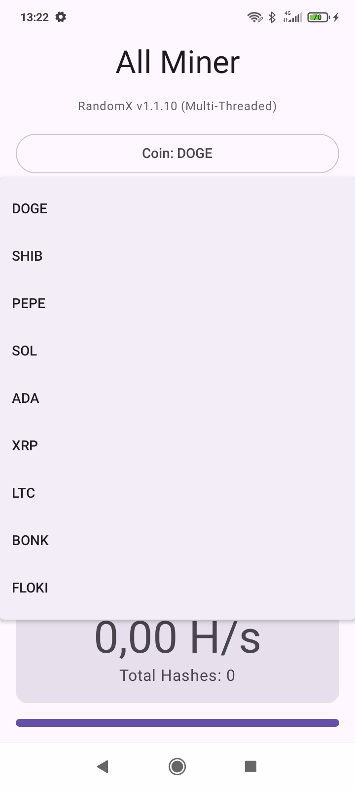
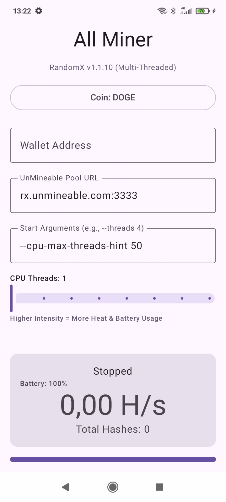

<h1>All Miner</h1>

<i>Modern and efficient Android crypto miner with RandomX support</i>

<h1>📸 Pictures of AllMiner in Action</h1>

<h1>Repository, Build and App Informations</h1>

AllMiner is a powerful crypto miner optimized specifically for Android devices. It utilizes the original RandomX engine to enable efficient hashing directly on your smartphone's CPU, primarily designed for unMineable pools.

## ✨ Key Features

- 🚀 **Native RandomX Engine**: High-performance C++ implementation optimized for ARM64 (aarch64) processors.
- 💰 **unMineable Support**: Mine a wide variety of coins (DOGE, SHIB, SOL, ADA, etc.) directly to your wallet.
- 🧵 **Multi-Threading**: Granular control over the number of CPU cores used to balance performance and battery life.
- 🛡️ **Hardware Protection**:
  - **Thermal Protection**: Automatically stops mining if the device gets too hot.
  - **Battery Protection**: Automatically stops if the battery level drops below 20%.
- 🎨 **Material 3 UI**: Clean, modern interface built with Jetpack Compose.
- 🔓 **FOSS**: 100% Free and Open Source Software under the GPLv3 license.

## 🛠️ Technology Stack

- **Jetpack Compose**: Modern UI framework for the Android frontend.
- **Kotlin**: Core application logic and ViewModel state management.
- **C++ (JNI/NDK)**: Native bridge to the RandomX hashing engine for maximum efficiency.
- **RandomX**: The original Monero-pioneered Proof-of-Work algorithm.

## 📥 Download & Installation

### Get the Latest Version

You can download the latest version of All Miner from the following platforms:

- **GitHub Releases**: [Direct Download](https://github.com/FreetimeMaker/All-Miner/releases/latest)
- **F-Droid**: [com.freetime.allminer](https://f-droid.org/packages/com.freetime.allminer)
- **GitHub Store**: [Open in GitHub Store](https://github-store.org/app?repo=FreetimeMaker/All-Miner)

## 📄 License

This project is licensed under the [GNU General Public License v3.0](LICENSE).

## ❤️ Support This Project

All Miner is 100% free. No ads. No tracking.

- ⭐ **[Star](https://github.com/FreetimeMaker/All-Miner/star)** this repository
- 🐛 **[Report](https://github.com/FreetimeMaker/All-Miner/issues)** bugs and issues
- 💡 **[Suggest](https://github.com/FreetimeMaker/All-Miner/discussions)** new features
- 💳 **[Sponsor](#-donations)** the developer

---

## 🤝 Contributing

Contributions are welcome! Feel free to open issues or submit pull requests.

### Contributors :handshake:

## 🌟 Star History

<a href="https://www.star-history.com/#FreetimeMaker/All-Miner&type=date&legend=top-left">
 <picture>
   <source media="(prefers-color-scheme: dark)" srcset="https://api.star-history.com/svg?repos=FreetimeMaker/All-Miner&type=date&theme=dark&legend=top-left" />
   <source media="(prefers-color-scheme: light)" srcset="https://api.star-history.com/svg?repos=FreetimeMaker/All-Miner&type=date&legend=top-left" />
   
 </picture>
</a>

---

## 🤝 Donations

If you like All Miner, I'd appreciate a small donation — thank you! Below are some common cryptocurrency options.

Alternatively, you can also display the addresses directly:

- Bitcoin (BTC): `1DsCAVrzvGokrzXpe6YR33QuTo5EppiKRE` — or open in block explorer by clicking the badge above
- Litecoin (LTC): `LU2ERRXKTeKnzpuieQcpsBteViEY7ff5Wg` — or open in block explorer by clicking the badge above

<i>Developed with ❤️ for the FOSS Community</i>

